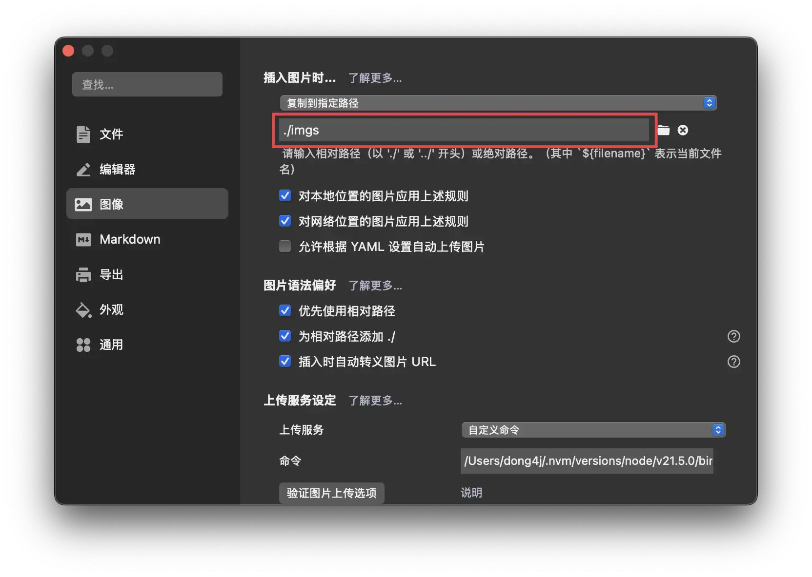
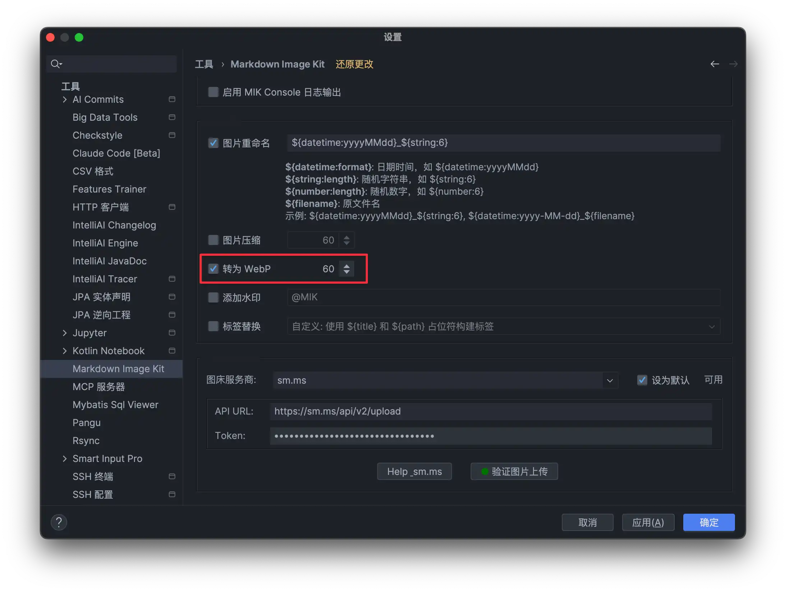
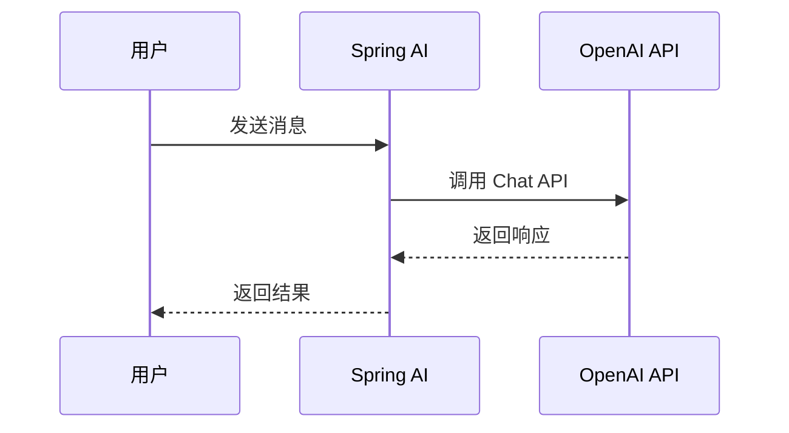
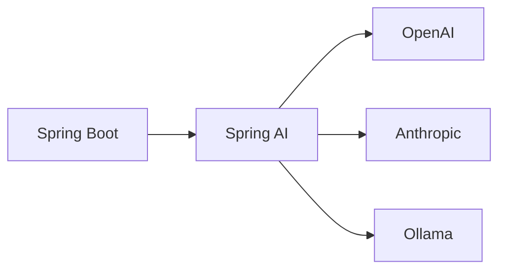

# 关于这个项目

## 📖 项目背景

**Spring AI Cookbook** 是一个全面的 Spring AI 学习教程项目，旨在帮助开发者从零开始学习和掌握 Spring AI 框架。

### 项目目标

- 🎯 **循序渐进**：从基础入门到高级应用，包含 20+ 个学习模块
- 💡 **实用性强**：每个模块都包含完整的代码示例和最佳实践
- 🚀 **快速上手**：5 分钟快速搭建第一个 Spring AI 项目
- 📚 **知识全面**：涵盖 Prompts、RAG、MCP、Vector Database 等核心功能

### 技术栈

- **Spring Boot**: 3.5.8
- **Spring AI**: 1.1.0
- **Java**: 25
- **文档构建**: VitePress 1.6.3

## 🤝 如何贡献

我们欢迎所有形式的贡献！无论是修复 bug、添加新功能、改进文档还是优化代码，都非常感谢。

### 贡献流程

1. **Fork 项目**：点击右上角的 Fork 按钮，将项目 Fork 到你的 GitHub 账号

2. **克隆仓库**：
   ```bash [bash]
   git clone https://github.com/YOUR_USERNAME/spring-ai-cookbook.git
   cd spring-ai-cookbook
   ```

3. **创建分支**：
   ```bash [bash]
   git checkout -b feature/your-feature-name
   # 或
   git checkout -b fix/your-bug-fix
   ```

4. **进行修改**：按照代码规范和文档规范进行开发

5. **提交代码**：
   ```bash [bash]
   git add .
   git commit -m "feat: 添加新功能描述"
   git push origin feature/your-feature-name
   ```

6. **创建 Pull Request**：在 GitHub 上创建 Pull Request，详细描述你的修改内容

### 提交信息规范

我们使用 [Conventional Commits](https://www.conventionalcommits.org/) 规范：

- `feat`: 新功能
- `fix`: 修复 bug
- `docs`: 文档更新
- `style`: 代码格式调整（不影响代码逻辑）
- `refactor`: 代码重构
- `test`: 测试相关
- `chore`: 构建工具或辅助工具的变动

示例：

```bash [bash]
feat: 添加 OpenAI Chat Model 支持
fix: 修复 RAG 检索时的空指针异常
docs: 更新快速开始文档
```

## 📐 代码规范

### Java 代码规范

本项目遵循 **Google Java Style Guide**，并配置了 Checkstyle 和 Google Java Format 进行代码检查。

#### 基本规范

- **缩进**：使用 4 个空格，不使用 Tab
- **行长度**：最大 120 个字符
- **编码**：UTF-8
- **换行符**：Unix 风格（LF）

#### 编辑器配置

项目已配置 `.editorconfig`，支持该规范的编辑器会自动应用格式：

```ini
[*]
charset = utf-8
end_of_line = lf
insert_final_newline = true
trim_trailing_whitespace = true

[*.java]
indent_style = space
indent_size = 4
max_line_length = 120
```

#### 代码格式化

使用 Google Java Format (AOSP 风格)：

```bash [bash]
# 格式化单个文件
mvn com.spotify.fmt:fmt-maven-plugin:format -pl <module-name>

# 格式化所有模块
mvn com.spotify.fmt:fmt-maven-plugin:format
```

#### Checkstyle 检查

```bash [bash]
# 检查单个模块
mvn checkstyle:check -pl <module-name>

# 检查所有模块
mvn checkstyle:check
```

### 代码风格要求

1. **类命名**：使用 PascalCase，如 `ChatClientService`
2. **方法命名**：使用 camelCase，如 `getChatResponse()`
3. **常量命名**：使用 UPPER_SNAKE_CASE，如 `MAX_RETRY_COUNT`
4. **包命名**：使用小写字母，多个单词用点分隔，如 `dev.dong4j.ai.chat`
5. **注释**：所有公共类和方法必须添加 JavaDoc 注释

## 📝 文档规范

### 文档结构

每个模块的文档应包含以下部分：

1. **标题**：清晰描述模块功能
2. **简介**：模块的作用和适用场景
3. **快速开始**：如何快速运行示例代码
4. **详细说明**：核心概念和使用方法
5. **代码示例**：完整的、可运行的代码示例
6. **最佳实践**：推荐的用法和注意事项
7. **相关链接**：相关的官方文档或其他模块

### Markdown 规范

- **标题层级**：使用 `#` 到 `######`，保持层级清晰
- **代码块**：使用语法高亮，如 ` ```java` 或 ` ```bash`
- **链接**：使用相对路径链接到其他文档，如 `[快速开始](./1.spring-ai-started/)`
- **图片**：
    - 使用相对路径，存储在模块的 `imgs/` 目录下
    - **必须使用 WebP 格式**，以减少图片体积，提高页面加载速度
    - 图片路径示例：``
    - 如果原始图片是其他格式（如 PNG、JPG），请先转换为 WebP 格式
- **列表**：使用 `-` 或 `*` 创建无序列表，使用数字创建有序列表
- **引用**：使用 `>` 创建引用块

> 推荐使用 Typora 编辑, 可以设置图片保存路径:
>
> 
>
> 但是 png 转 webp 需要自行处理, 下面提供一段 Linux 脚本:
>
> ```bash [bash]
> webp() {
> input="$1"
> output="$2"
> 
> if [ -z "$input" ]; then
>  echo "Usage: webp <input_file> [output_file]"
>  return 1
> fi
> 
> # 如果没有传第二个参数，自动替换扩展名为 .webp
> if [ -z "$output" ]; then
>  filename="${input%.*}"   # 去掉扩展名
>  output="${filename}.webp"
> fi
> 
> # 删除元数据
> exiftool -overwrite_original -all= "$input" > /dev/null 2>&1
> 
> # 转为 WebP
> cwebp -q 50 "$input" -o "$output" > /dev/null 2>&1
> 
> echo "convert '$input' to '$output'"
> }
> ```
>
> 使用方式:
> ```bash [bash]
> # 1. 传入输入文件和输出文件
> # 将 a.jpg 转为 a_small.webp
> webp a.jpg a_small.webp
> 
> 
> # 2. 只传一个参数（最常用）
> # 输出自动变为同名 .webp，如：
> # input = "picture.png"
> # output = "picture.webp"
> webp picture.png
> 
> # 3. 查看提示（不传参数）
> webp
> # 输出：Usage: webp <input_file> [output_file]
> 
> # 4. 批量转换（结合 shell 的 for 循环）
> for img in *.jpg; do
>   webp "$img"
> done
> # 将当前目录所有 jpg 自动转换为同名 webp
> ```
>
> ---
>
> macOS 需要提前安装 `cwebp`:
>
> ```bash [bash]
> brew install webp
> ```
>
> [其他系统下载并安装 WebP](https://developers.google.com/speed/webp/download?hl=zh-cn)
>
> ---
>
> 如果直接在 IDEA 中编辑, 可以下载 [Markdown Image Kit](https://plugins.jetbrains.com/plugin/12192-markdown-image-kit/new-page) 插件, 提供与 Typora 相同的功能, 且提供 webp 转换:
>
> 

---

### VitePress 特殊语法

基于 VitePress 构建，支持丰富的 Markdown 扩展语法，可以让文档更加生动和易读。

#### 代码图标

在代码块中添加文件图标，使用文件名作为标签即可自动显示对应的图标：

**Markdown 源代码**：

````markdown
```js [vite.config.js]
import { defineConfig } from 'vite'
```
````

**渲染效果**：

```js [vite.config.js]
import { defineConfig } from 'vite'
```

支持的图标类型包括：

**包管理器**：

- `npm`、`yarn`、`pnpm`、`bun`、`deno`

**框架**：

- `vue`、`svelte`、`angular`、`react`、`next`、`nuxt`、`solid`、`astro`、`qwik`、`ember`

**构建工具**：

- `rollup`、`webpack`、`vite`、`esbuild`

**配置文件**：

- `package.json`、`tsconfig.json`、`.npmrc`、`.editorconfig`、`.eslintrc`、`.eslintignore`、`eslint.config`、`.gitignore`、`.gitattributes`、`.env`、`.env.example`、`.vscode`、`tailwind.config`、`uno.config`、`unocss.config`、`.oxlintrc`、`vue.config`

**文件扩展名**：

- `.mts`、`.cts`、`.ts`、`.tsx`、`.mjs`、`.cjs`、`.json`、`.js`、`.jsx`、`.md`、`.py`、`.ico`、`.html`、`.css`、`.scss`、`.yml`、`.yaml`、`.php`、`.gjs`、`.gts`、`.java`、`.xml`

#### 代码组（Code Group）

展示多种安装或使用方式的代码块组合：

**Markdown 源代码**：

````markdown
::: code-group

```sh [npm]
npm install spring-ai-openai-spring-boot-starter
```

```sh [yarn]
yarn add spring-ai-openai-spring-boot-starter
```

```sh [pnpm]
pnpm add spring-ai-openai-spring-boot-starter
```

```sh [bun]
bun add spring-ai-openai-spring-boot-starter
```

:::
````

**渲染效果**：

::: code-group

```sh [npm]
npm install spring-ai-openai-spring-boot-starter
```

```sh [yarn]
yarn add spring-ai-openai-spring-boot-starter
```

```sh [pnpm]
pnpm add spring-ai-openai-spring-boot-starter
```

```sh [bun]
bun add spring-ai-openai-spring-boot-starter
```

:::

#### 时间线（Timeline）

展示事件或步骤的时间线：

**Markdown 源代码**：

````markdown
::: timeline 2023-05-24

- **Spring AI 首次发布**
- 支持 OpenAI 集成
- 支持 Azure OpenAI

:::

::: timeline 2023-05-23

- Spring AI 项目启动
- 社区反馈收集

:::
````

**渲染效果**：

::: timeline 2023-05-24

- **Spring AI 首次发布**
- 支持 OpenAI 集成
- 支持 Azure OpenAI

:::

::: timeline 2023-05-23

- Spring AI 项目启动
- 社区反馈收集

:::

#### 思维导图（Markmap）

使用 Markmap 创建可交互的思维导图：

**Markdown 源代码**：

````markdown
```markmap
# Spring AI
## Chat Model
- OpenAI
- Anthropic
- Ollama
## Embedding Model
- OpenAI Embeddings
- Azure OpenAI Embeddings
## Image Model
- DALL-E
- Stability AI
```
````

**渲染效果**：

```markmap
# Spring AI
## Chat Model
- OpenAI
- Anthropic
- Ollama
## Embedding Model
- OpenAI Embeddings
- Azure OpenAI Embeddings
## Image Model
- DALL-E
- Stability AI
```

#### 流程图（Mermaid）

使用 Mermaid 创建流程图、时序图、甘特图等：

**Markdown 源代码**：

````markdown



````

**渲染效果**：


#### Badge 组件

使用 Badge 组件标注版本、状态等信息：

**Markdown 源代码**：

```markdown
- Spring AI <Badge type="info" text="1.1.0" />
- Spring Boot <Badge type="tip" text="3.5.8" />
- Java <Badge type="warning" text="25" />
- 实验性功能 <Badge type="danger" text="beta" />
```

**渲染效果**：

- Spring AI <Badge type="info" text="1.1.0" />
- Spring Boot <Badge type="tip" text="3.5.8" />
- Java <Badge type="warning" text="25" />
- 实验性功能 <Badge type="danger" text="beta" />

#### 聚焦代码

高亮代码中的特定行，便于讲解：

**Markdown 源代码**：

````markdown
```java{4,8-10}
@RestController
public class ChatController {
    
    private final ChatClient chatClient;  // [!code focus]
    
    @GetMapping("/chat")
    public String chat(@RequestParam String message) {  // [!code focus]
        return chatClient.call(message);  // [!code focus]
    }
}
```
````

**渲染效果**：

```java{4,8-10}
@RestController
public class ChatController {
    
    private final ChatClient chatClient;  // [!code focus]
    
    @GetMapping("/chat")
    public String chat(@RequestParam String message) {  // [!code focus]
        return chatClient.call(message);  // [!code focus]
    }
}
```

#### 双向链接

创建文档之间的双向链接：

**Markdown 源代码**：

```markdown
[[0.spring-ai-introduction/index|Spring AI 简介]]
[[1.spring-ai-started/index|快速开始]]
```

**渲染效果**：

[[0.spring-ai-introduction/index|Spring AI 简介]]

[[1.spring-ai-started/index|快速开始]]

#### GitHub 风格警报

使用 GitHub 风格的警报框突出重要信息：

**Markdown 源代码**：

```markdown
> [!提醒] 重要
> 强调用户在快速浏览文档时也不应忽略的重要信息。

> [!建议]
> 有助于用户更顺利达成目标的建议性信息。

> [!重要]
> 对用户达成目标至关重要的信息。

> [!警告]
> 因为可能存在风险，所以需要用户立即关注的关键内容。

> [!注意]
> 行为可能带来的负面影响。
```

**渲染效果**：

> [!提醒] 重要
> 强调用户在快速浏览文档时也不应忽略的重要信息。

> [!建议]
> 有助于用户更顺利达成目标的建议性信息。

> [!重要]
> 对用户达成目标至关重要的信息。

> [!警告]
> 因为可能存在风险，所以需要用户立即关注的关键内容。

> [!注意]
> 行为可能带来的负面影响。

#### 技术栈徽章

使用 Shields.io 展示技术栈徽章：

**Markdown 源代码**：

````markdown
<p>
   
   
   
</p>
````

**渲染效果**：

<p>
   
   
   
</p>

### 文档位置

**文档写在各个子模块的 `README.md` 文件中**，例如：

```
1.spring-ai-started/
  ├── README.md          # 文档内容
  ├── imgs/              # 图片资源（必须使用 WebP 格式）
  │   ├── example1.webp
  │   └── example2.webp
  └── src/               # 源代码
```

> [!重要] 图片格式要求
> - 所有图片必须使用 **WebP 格式**（`.webp` 扩展名）
> - 如果原始图片是其他格式（如 PNG、JPG、JPEG），请先转换为 WebP 格式
> - WebP 格式可以在保证图片质量的同时显著减少文件体积，提高页面加载速度

### 文档示例模板

```markdown
# 模块名称

## 📖 简介

简要介绍这个模块的功能和作用。

## 🚀 快速开始

### 前置要求

- Java 25+
- Maven 3.8+

### 运行示例

```bash [bash]
cd 1.spring-ai-started
mvn spring-boot:run
```

## 📝 详细说明

...

## 💻 代码示例

```java
@SpringBootApplication
public class Application {
    public static void main(String[] args) {
        SpringApplication.run(Application.class, args);
    }
}
```

## 🖼️ 图片使用

使用相对路径引用图片，**必须使用 WebP 格式**：

```markdown

```

## ✨ 最佳实践

- 建议 1
- 建议 2

```

## 🔄 如何同步文档

文档同步是指将各个子模块的 `README.md` 和图片资源同步到 `docs/` 目录，以便在 VitePress 文档站点中显示。

### 自动同步

使用项目提供的同步脚本：

```bash [bash]
# 在 docs 目录下执行
cd docs
npm run sync

# 或直接执行脚本
bash sync-docs.sh
```

### 同步脚本功能

同步脚本会自动完成以下操作：

1. **扫描子模块**：查找所有以数字开头的模块目录（如 `1.spring-ai-started`）
2. **复制文档**：将 `README.md` 复制为 `docs/<module-name>/index.md`
3. **同步图片**：将 `imgs/` 目录下的所有图片复制到 `docs/<module-name>/imgs/`
4. **添加代码链接**：在文档末尾自动添加 GitHub 代码仓库链接
5. **清理已删除模块**：删除 `docs/` 中已不存在的模块

### 手动同步

如果需要手动同步单个模块：

```bash [bash]
# 复制文档
cp 1.spring-ai-started/README.md docs/1.spring-ai-started/index.md

# 复制图片（如果存在）
cp -r 1.spring-ai-started/imgs docs/1.spring-ai-started/imgs
```

### 注意事项

- ⚠️ 不要在 `docs/` 目录下直接编辑文档，修改应该在子模块的 `README.md` 中进行
- ⚠️ **所有图片必须使用 WebP 格式**，图片路径应使用相对路径 `./imgs/xxx.webp`
- ⚠️ 同步脚本会完全同步 `imgs/` 目录，源目录中删除的图片也会从 `docs/` 中删除

## 🚀 如何执行 GitHub Actions

GitHub Actions 用于自动构建和部署文档站点。了解触发条件非常重要，可以避免不必要的部署或确保文档及时更新。

### 触发方式

**默认配置：仅手动触发（推荐）**

Workflow 默认配置为**仅手动触发**，不会在每次提交时自动执行。这样可以节省 GitHub Actions 运行时间，避免不必要的部署，完全控制部署时机。

**手动触发步骤**：

1. 访问项目的 GitHub 仓库：`https://github.com/dong4j/spring-ai-cookbook`
2. 点击 **Actions** 标签页
3. 选择 **Deploy Docs to ECS** workflow
4. 点击 **Run workflow** 按钮
5. 选择分支（通常是 `main` 或 `master`）
6. 点击 **Run workflow** 开始执行

### 自动触发条件

如果启用了自动触发，workflow 的触发和执行需要**同时满足**以下三个条件：

1. **推送到 `main` 或 `master` 分支**
2. **变更的文件是任意位置的 README.md**：
    - 包括项目根目录和所有子模块的 `README.md` 文件
    - **注意**：修改 workflow 配置文件、`docs/about.md`、或其他文档文件**不会**触发部署
3. **提交信息中包含 `[deploy-docs]` 关键词**

> [!重要] 触发条件
> 只有**同时满足**以上三个条件，workflow 才会被触发并执行部署。其他情况都会被忽略。

### 触发示例

**✅ 会触发并执行部署**：

```bash [bash]
# 场景 1：修改项目根目录的 README.md
git add README.md
git commit -m "更新项目说明 [deploy-docs]"
git push origin main

# 场景 2：修改子模块的 README.md
git add 1.spring-ai-started/README.md
git commit -m "更新模块文档 [deploy-docs]"
git push origin main

# 场景 3：修改了多个子模块的 README.md
git add 1.spring-ai-started/README.md 2.spring-ai-chat-client/README.md
git commit -m "更新多个模块文档 [deploy-docs]"
git push origin main
```

**❌ 不会触发**：

```bash [bash]
# 场景 1：提交信息缺少 [deploy-docs]
git add README.md
git commit -m "更新项目说明"  # ❌ 缺少 [deploy-docs]
git push origin main

# 场景 2：修改了 workflow 配置文件
git add .github/workflows/deploy-docs.yml
git commit -m "更新部署配置 [deploy-docs]"  # ❌ 不是 README.md
git push origin main

# 场景 3：修改了 docs/about.md
git add docs/about.md
git commit -m "更新关于页面 [deploy-docs]"  # ❌ 不是 README.md
git push origin main

# 场景 4：修改了代码文件
git add src/main/java/App.java
git commit -m "修复bug [deploy-docs]"  # ❌ 不是 README.md
git push origin main
```

### 工作原理总结

- ✅ **会触发并执行**：修改了任意位置的 `README.md` 文件 + 提交信息包含 `[deploy-docs]` + 推送到 `main`/`master` 分支
- ❌ **会被忽略**：其他所有情况，包括：
    - 修改了 `README.md` 但提交信息不包含 `[deploy-docs]`
    - 修改了 workflow 配置文件（即使提交信息包含 `[deploy-docs]`）
    - 修改了 `docs/about.md` 或其他文档文件
    - 修改了代码文件
- 🔧 **手动触发**：不受以上限制，随时可以通过 GitHub Actions 页面手动触发

## 📚 相关资源

### 项目链接

- **GitHub 仓库**：https://github.com/dong4j/spring-ai-cookbook
- **文档站点**：https://springai.dong4j.site
- **Issues**：https://github.com/dong4j/spring-ai-cookbook/issues

### 官方文档

- **Spring AI 官方文档**：https://docs.spring.io/spring-ai/reference/
- **Spring Boot 官方文档**：https://spring.io/projects/spring-boot

### 社区资源

- **Awesome Spring AI**：https://github.com/spring-ai-community/awesome-spring-ai
- **Spring AI 社区**：https://github.com/spring-ai-community

## 👥 团队成员

感谢以下团队成员对 Spring AI Cookbook 项目的贡献和支持！

<script setup>
import { VPTeamMembers } from 'vitepress/theme'

const members = [
  {
    avatar: 'https://www.github.com/dong4j.png',
    name: 'dong4j',
    title: 'Creator',
    org: 'Zeka.Stack',
    orgLink: 'https://github.com/zeka-stack',
    desc: '司机带你开车',
    links: [
      { icon: 'github', link: 'https://github.com/dong4j' },
      { icon: 'twitter', link: 'https://twitter.com/dong4j' }
    ]
  },
  {
    avatar: 'https://www.github.com/ogromwang.png',
    name: 'ogromwang',
    title: 'Developer',
    org: 'Zeka.Stack',
    orgLink: 'https://github.com/zeka-stack',
    desc: '',
    links: [
      { icon: 'github', link: 'https://github.com/ogromwang' }
    ]
  },
  {
    avatar: 'https://www.github.com/hyqf98.png',
    name: 'hyqf98',
    title: 'Developer',
    org: 'Zeka.Stack',
    orgLink: 'https://github.com/zeka-stack',
    desc: '',
    links: [
      { icon: 'github', link: 'https://github.com/hyqf98' }
    ]
  }
]
</script>

<VPTeamMembers size="small" :members="members" />


## 💬 联系我们

如有问题或建议，欢迎：

- 📧 提交 Issue：https://github.com/dong4j/spring-ai-cookbook/issues
- 💬 发起讨论：https://github.com/dong4j/spring-ai-cookbook/discussions
- 🐛 报告 Bug：请使用 Issue 模板

---

感谢你对 Spring AI Cookbook 项目的关注和支持！🎉
